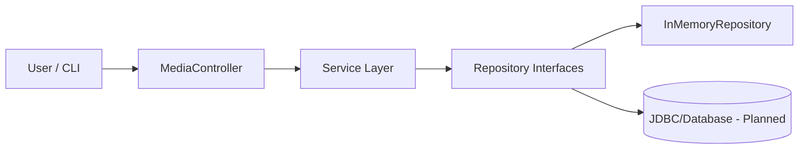
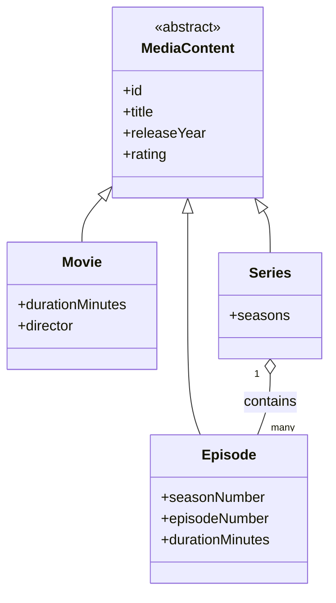

# Movie Streaming Platform — Assignment 4 (SOLID + Advanced OOP)

## 1) Project Overview
This project implements a **Movie Streaming Platform** backend in Java using a layered architecture (controller → service → repository → data) and demonstrates SOLID principles, advanced OOP features, and JDBC-ready schema design. The domain includes movies, series, and episodes with composition and CRUD workflows. The current implementation is a console-driven controller that exercises the services and repositories; the database schema is provided for JDBC integration. 

**Entities**:
- `MediaContent` (abstract base class)
- `Movie` (extends `MediaContent`, includes `durationMinutes` and `director`)
- `Series` (extends `MediaContent`, includes `seasons`)
- `Episode` (extends `MediaContent`, includes `seasonNumber`, `episodeNumber`, `durationMinutes`)

**Relationships**:
- `Series` aggregates a list of `Episode` objects (composition in-memory).

## 2) Repository Structure
```
src/main/java/com/assignment3
├── Main.java
├── controller/
│   └── MediaController.java
├── exception/
│   ├── DatabaseOperationException.java
│   ├── DuplicateResourceException.java
│   ├── InvalidInputException.java
│   └── ResourceNotFoundException.java
├── factory/
│   └── MediaContentFactory.java
├── interfaces/
│   ├── Playable.java
│   ├── Rateable.java
│   └── Validatable.java
├── model/
│   ├── Episode.java
│   ├── MediaContent.java
│   ├── Movie.java
│   └── Series.java
├── repository/
│   └── InMemoryRepository.java
├── repository/interfaces/
│   ├── CrudRepository.java
│   └── IdExtractor.java
├── service/
│   ├── EpisodeService.java
│   ├── MovieService.java
│   └── SeriesService.java
└── utils/
    ├── ReflectionUtils.java
    └── SortingUtils.java
```

## 3) SOLID & OOP Summary
**SRP (Single Responsibility)**
- Controller handles I/O + orchestration only; services handle validation and business rules; repositories handle storage.

**OCP (Open/Closed)**
- `MediaContent` is open for extension by new content types without changing existing logic.

**LSP (Liskov Substitution)**
- `Movie`, `Series`, and `Episode` can be used anywhere a `MediaContent` is expected.

**ISP (Interface Segregation)**
- `Playable`, `Rateable`, and `Validatable` are small, focused interfaces for specific behavior.

**DIP (Dependency Inversion)**
- Services depend on `CrudRepository` abstractions (interfaces), not concrete repository implementations.

**Advanced OOP Features**
- **Generics**: `CrudRepository<T, ID>` and `InMemoryRepository<T, ID>` provide generic CRUD operations.
- **Lambdas**: Sorting and filtering use lambda expressions in service layer.
- **Reflection**: `ReflectionUtils` inspects class metadata for demonstration.
- **Interface default/static methods**: `Rateable.isTopRated()` and `Playable.supportsOffline()`.

## 4) Component Principles (REP/CCP/CRP)
- **REP (Reuse/Release Equivalence Principle)**: Reusable modules are grouped by domain layer (controller, service, repository, utils). The repository abstractions and utilities can be released as independent modules.
- **CCP (Common Closure Principle)**: Classes that change together (e.g., repository interfaces and implementations) are colocated to reduce change ripple.
- **CRP (Common Reuse Principle)**: Consumers can depend on `service` or `repository/interfaces` without inheriting unused concrete implementations.

## 5) Design Patterns Section
Implemented patterns and where they appear:
- **Singleton**: `DatabaseConnection` is a singleton with `initialize(...)` and `getInstance()` to enforce a shared JDBC configuration provider.
- **Factory**: `MediaContentFactory` creates `Movie`, `Series`, and `Episode` instances to centralize instantiation logic.
- **Builder**: `Movie.Builder`, `Series.Builder`, and `Episode.Builder` provide fluent construction with optional fields.

## 6) REST API Documentation (Planned Spring Boot Migration)
The current build is console-driven; the next step is to expose REST endpoints via Spring Boot. Below is the intended API contract that matches the existing services and repositories:

**Base URL**: `/api`

**Movies**
- `GET /api/movies` → list movies
- `POST /api/movies` → create movie
- `PUT /api/movies/{id}` → update movie
- `DELETE /api/movies/{id}` → delete movie

**Series**
- `GET /api/series`
- `POST /api/series`
- `PUT /api/series/{id}`
- `DELETE /api/series/{id}`

**Episodes**
- `GET /api/series/{seriesId}/episodes`
- `POST /api/series/{seriesId}/episodes`
- `PUT /api/series/{seriesId}/episodes/{episodeId}`
- `DELETE /api/series/{seriesId}/episodes/{episodeId}`

**Sample JSON (Movie)**
```json
{
  "title": "Interstellar",
  "releaseYear": 2014,
  "rating": 8.6,
  "durationMinutes": 169,
  "director": "Christopher Nolan"
}
```

## 7) Database Schema (PostgreSQL)
Schema and sample inserts are defined in:
- `src/main/resources/schema.sql`

**Tables**:
- `movies`
- `series`
- `episodes` (FK → `series.id`)

**Constraints**:
- Primary keys for all tables
- Unique titles for movies/series
- Foreign key + `ON DELETE CASCADE`
- CHECK constraints for ratings, durations, and release years

## 8) Controller + Service + Repository Responsibilities
**Controller Layer**
- Handles simple input orchestration.
- Delegates operations to services.

**Service Layer**
- Validates entities, applies business rules.
- Uses repository interface (DIP) and lambdas.

**Repository Layer**
- Generic CRUD interface and in-memory implementation.
- Ready for JDBC repository implementations.

## 9) Demonstration & Output Expectations
The `MediaController.demoCrudFlow()` demonstrates:
- Creating multiple entities
- Updating entities
- Deleting entities
- Validation + exceptions
- Polymorphism using a `MediaContent` list
- Reflection utility output
- Lambda sorting utilities

## 10) System Architecture Diagram


## 11) UML (Class Relationships)


## 12) Execution Instructions
**Compile**:
```bash
javac -d out $(find src/main/java -name "*.java")
```

**Run**:
```bash
java -cp out com.assignment3.Main
```

## 13) Screenshots Checklist
Include screenshots in your submission showing:
- Successful CRUD operations
- Validation failures
- Reflection output
- Sorted lists using lambdas

## 14) Reflection
**What I learned**:
- Applying SOLID in layered Java applications with clean boundaries.
- Using generics and lambdas to build reusable utilities.

**Challenges**:
- Balancing validation rules across service and repository layers.

**Value of SOLID architecture**:
- Easier testing, extensibility, and maintainability.

## 15) GitHub Workflow Reminder
- Push the repo to GitHub and ensure it is **public** for submission.
- Paste the GitHub URL in Moodle as the official submission.
